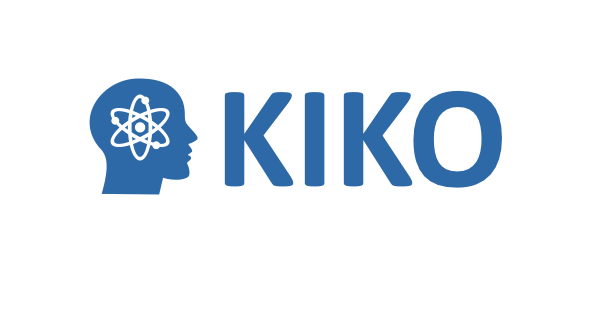

<p align="center">
  
</p>

<h1 align="center">KIKO Platform</h1>

<p align="center">
  AI-assisted knowledge preservation, learning, and retrieval for
  knowledge-intensive domains.
</p>

<p align="center">
  <a href="./docs/development/">Documentation</a> ·
  <a href="SECURITY.md">Issues</a> ·
  <a href="CONTRIBUTING.md">Contributing</a> ·
  <a href="CITATION.cff">Citation</a>
</p>

<!-- Tech stack start -->
<p>
    <a href="https://www.python.org/" target="_blank" style="margin: 2px;">
        
    </a>
    <a href="https://react.dev/" target="_blank" style="margin: 2px;">
        
    </a>
    <a href="https://fastapi.tiangolo.com/" target="_blank" style="margin: 2px;">
        
    </a>
    <a href="https://www.postgresql.org/" target="_blank" style="margin: 2px;">
        
    </a>
    <a href="https://github.com/pgvector/pgvector" target="_blank" style="margin: 2px;">
        
    </a>
    <a href="https://ollama.com/" target="_blank" style="margin: 2px;">
        
    </a>
    <a href="https://www.langchain.com/" target="_blank" style="margin: 2px;">
        
    </a>
    <a href="https://huggingface.co/" target="_blank" style="margin: 2px;">
        
    </a>
    <a href="https://www.docker.com/" target="_blank" style="margin: 2px;">
        
    </a>
    <a href="https://python-poetry.org/" target="_blank" style="margin: 2px;">
        
    </a>
    <a href="https://developer.nvidia.com/cuda-zone" target="_blank" style="margin: 2px;">
        
    </a>
</p>
<!-- Tech stack end -->

<!-- Models stack start -->
<p>
  <!-- Embeddings -->
  <a href="https://ollama.com/library/nomic-embed-text" target="_blank" style="margin: 2px;">
    
  </a>
  <!-- VLM -->
  <a href="https://ollama.com/library/qwen2.5vl" target="_blank" style="margin: 2px;">
    
  </a>
  
  <!-- LLMs (generation) start -->
  <a href="https://ollama.com/library/llama3.3" target="_blank" style="margin: 2px;">
    
  </a>
  <!-- <a href="https://ollama.com/library/gemma4" target="_blank" style="margin: 2px;">
    
  </a> -->
  <a href="https://ollama.com/library/nemotron" target="_blank" style="margin: 2px;">
    
  </a>
  <!-- HF models -->
  <a href="https://huggingface.co/" target="_blank" style="margin: 2px;">
    
  </a>
  <!-- LLMs (generation) end -->
  
  <!-- LLMs (grading / inference) start -->
  <a href="https://ollama.com/library/deepseek-r1" target="_blank" style="margin: 2px;">
    
  </a>
  <a href="https://ollama.com/library/nemotron-3-super" target="_blank" style="margin: 2px;">
    
  </a>
  <!-- LLMs (grading / inference) end -->
</p>
<!-- Models stack end -->

# 🌱 Why KIKO?

KIKO is an AI-powered knowledge and learning platform originally developed for
knowledge preservation and learning workflows in nuclear decommissioning. It combines document processing, retrieval-augmented generation, course
generation, AI-assisted learning, and role-based workflows for learners,
instructors, and administrators.

# ✨ Key Features

## 👨‍🏫 Instructors

- Generate structured courses from source documents
- Review and edit generated modules
- Create practice questions and quizzes
- Review common misconceptions
- Manage courses and learning resources

## 👨‍🎓 Learners

- Discover and enroll in courses
- Learn through structured modules
- Answer practice questions
- Receive AI-assisted grading and feedback
- Complete module and final assessments
- Track learning progress

## 💬 Knowledge Assistant

- Upload and manage documents
- Ask questions using available knowledge
- Review supporting sources
- Choose from configured AI models
- Maintain or clear chat history

## 🛡️ Administrators

- Manage application configuration
- Configure supported models and platform behavior
- Maintain knowledge-assessment settings

# 🏗️ Architecture

```bash
User
  └── React + TypeScript Frontend
        └── Nginx /api proxy
              └── FastAPI Backend
                    ├── PostgreSQL + pgvector
                    ├── Ollama models
                    ├── Hugging Face models
                    ├── Email service
                    └── Document processing pipeline
```

See [docs/architecture.md](docs/architecture.md) for details.

# 🚦 Project Status

KIKO currently uses a React + TypeScript frontend with a FastAPI backend.

The active application stack consists of:

- **Frontend:** React + TypeScript (`frontend/`)
- **Backend:** FastAPI (`backend/`)
- **Database:** PostgreSQL + pgvector
- **Local AI runtime:** Ollama
- **Additional model integration:** Hugging Face
- **Deployment:** Docker Compose
- **Roles:** Learner, Instructor, and Admin

The previous Streamlit implementation is retained in
[`frontend-streamlit/`](frontend-streamlit) for legacy reference only.

> **Note:**
> New frontend development should be implemented in `frontend/`.
> The Streamlit frontend is no longer the active application frontend.

# 🚀 Quick Start

## ✅ Prerequisites

Required:

- Git
- Docker Engine
- Docker Compose v2

For GPU acceleration:

- NVIDIA GPU
- Compatible NVIDIA driver
- NVIDIA Container Toolkit

For optional local/non-container development:

- Python version defined by the backend project
- Node.js version defined by the frontend project

Some Hugging Face models may require a Hugging Face access token.

## ▶️ Run locally

1. Clone the repository:
   ```bash
   git clone https://github.com/DataScienceLabFHSWF/kiko-platform.git
   ```
   ```bash
   cd kiko-platform
   ```
2. Review the development environment file:
   ```bash
   cat .env.dev
   ```
3. Start the development stack:
   ```bash
   ENV_FILE=.env.dev docker compose --env-file .env.dev -p <YOUR_PROJECT_NAME> -f docker-compose.dev.yml up -d --build
   ```
4. Check running containers:
   ```bash
   docker compose --env-file .env.dev -p <YOUR_PROJECT_NAME> -f docker-compose.dev.yml ps
   ```

## ▶️ Open locally:

Default development ports from `.env.dev`:

- React + TypeScript Frontend -> http://localhost:8003
- Fast API Backend (API) -> http://localhost:8004
- Fast API Backend (docs) -> http://localhost:8004/docs
- PostgreSQL -> Docker Host port is 8005 and database port is **5432**.
- Ollama -> Docker Host port is 8006 and Ollama port is **11434**.

The frontend proxies API requests through `/api`, so normal users should open only the frontend URL.

**Note**:

- If multiple people are running the `docker-compose.dev` on same server then it would be better to change the all service name in both `.env.dev` and `docker-compose.dev.yml` to avoid conflicts. e.g.- kiko-frontend-service-dev => kiko-frontend-service-dev-**username**.
- If you get port issue? Then change the respective **docker host port number** of service in file `.env.dev` to different unused port.

## 🛑 Stop the development stack:

```bash
ENV_FILE=.env.dev docker compose --env-file .env.dev -p <YOUR_PROJECT_NAME> -f docker-compose.dev.yml down --remove-orphans
```

To also remove local development volumes:

```bash
ENV_FILE=.env.dev docker compose --env-file .env.dev -p <YOUR_PROJECT_NAME> -f docker-compose.dev.yml down --remove-orphans --volumes
```

Use `--volumes` only when you intentionally want to delete the local database and local Ollama model

# ⚙️ Configuration

KIKO is configured through environment variables.

For local development, the repository includes:

```bash
.env.dev
docker-compose.dev.yml
```

Never commit your real `.env.dev` file.

Important variables:

| Variable                    | Purpose                                                              |
| --------------------------- | -------------------------------------------------------------------- |
| APP_ENV                     | Runtime environment: development, stage, production                  |
| LOG_LEVEL                   | Backend logging level                                                |
| SECRET_KEY                  | JWT/application signing secret                                       |
| ACCESS_TOKEN_EXPIRE_MINUTES | Access token lifetime                                                |
| DATABASE_URL                | Backend database connection                                          |
| HUGGINGFACE_HUB_TOKEN       | Optional Hugging Face access token                                   |
| DOCKER_OLLAMA_URL           | Backend-to-Ollama service URL                                        |
| FRONTEND_PORT               | Host port for the frontend                                           |
| FRONTEND_PUBLIC_URL         | Public frontend URL used in password-reset emails                    |
| BACKEND_PORT                | Host port for the backend                                            |
| EMAIL_PROVIDER              | Email backend: console for development, SMTP/provider for production |
| NVIDIA_GPU_DEVICE_ID        | GPU ID used by Docker/NVIDIA runtime                                 |

See [.env.dev](.env.dev) for the full list.

# 🐛 Troubleshooting

For Docker logs, email debugging, GPU troubleshooting, and common development
issues, see [docs/development/troubleshooting.md](docs/development/troubleshooting.md).

# 🚀 Stage and production deployment

Stage and production deployment files are **server-only** and must not be committed to GitHub.

Expected server-only files:

```bash
.env.stage
docker-compose.stage.yml
.env.production
docker-compose.production.yml
```

Example stage command on the server:

```bash
ENV_FILE=.env.stage docker compose --env-file .env.stage -p kiko-stage -f docker-compose.stage.yml up -d --build
```

Stage backend logs:

```bash
docker compose --env-file .env.stage -p kiko-stage -f docker-compose.stage.yml logs -f kiko-backend-service-stage
```

Example production command on the server:

```bash
ENV_FILE=.env.production docker compose --env-file .env.production -p kiko-production -f docker-compose.production.yml up -d --build
```

Production backend logs:

```bash
docker compose --env-file .env.production -p kiko-production -f docker-compose.production.yml logs -f kiko-backend-service-production
```

Production should not expose PostgreSQL or Ollama publicly. Only the frontend or a reverse proxy should be publicly reachable.

# 🔐 Security notes

- Never commit real `.env`, `.env.dev`, `.env.stage`, or `.env.production` files.
- Never commit real Hugging Face, SMTP, database, or JWT secrets.
- `.env.dev` is committed only for local development and must contain dummy values.
- Use different `SECRET_KEY` values for development, stage, and production.
- Use `EMAIL_PROVIDER=console` only for development.
- Use HTTPS in production.
- Do not run destructive database reset commands in stage or production.

# 📁 Project Structure

| Folder              | Purpose                                          |
| ------------------- | ------------------------------------------------ |
| backend/            | FastAPI backend                                  |
| frontend/           | Current React + TypeScript frontend              |
| frontend-streamlit/ | Legacy Streamlit frontend retained for reference |
| docker/ollama/      | Ollama container/runtime configuration           |
| shared/             | Shared utilities and configuration               |
| notebooks/          | Research and evaluation notebooks                |
| tests/backend/      | Backend tests                                    |
| docs/               | Public documentation and GitHub Pages content    |
| .github/            | GitHub workflows and contribution templates      |

# 📚 Documentation

- Architecture
- Models
- Database development
- Notebook setup
- React migration status
- Optional ngrok deployment

The public project page is published with GitHub Pages from the [`docs/`](docs) directory.

# 🤝 Contributing

Contributions are welcome. Please read [`CONTRIBUTING.md`](CONTRIBUTING.md) before opening an issue or pull request.

For small changes, open a focused pull request. For larger changes, open an issue first so the design can be discussed.

# 📄 License

This project is released under the license specified in [`LICENSE`](LICENSE).

# 📌 Citation

If you use KIKO in academic work, please cite it using [`CITATION.cff`](CITATION.cff).

# 👨‍🔧 Maintainers

- [Amir](https://github.com/Amirkz80) – Data Engineering (DE), Fullstack.
- [Ole](https://github.com/hennkar) – DE, Ontology, Fullstack.
- [Ferdinand](https://github.com/f-schreiber) - Ontology, Fullstack.
- [Sanjay Gupta](https://github.com/sanjaycg486) – Fullstack, Architecture and LLMs.

**Automated dependency updates are handled by Dependabot.**

# 💬 Questions or Feedback?

Open an [issue](https://github.com/DataScienceLabFHSWF/kiko-platform/issues) for bugs, feature requests, or documentation improvements.

```

```
